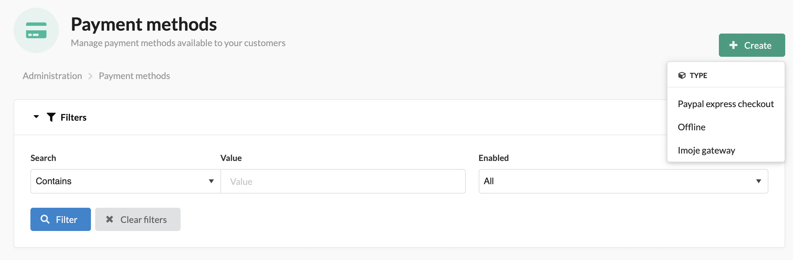
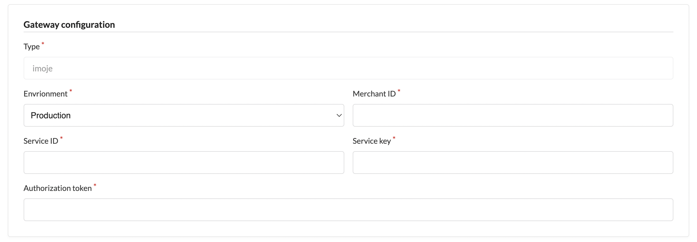

# ING Payments Plugin for Sylius
----

At BitBag we do believe in open source. However, we are able to do it just because of our awesome clients, who are kind enough to share some parts of our work with the community. Therefore, if you feel like there is a possibility for us working together, feel free to reach us out. You will find out more about our professional services, technologies and contact details at [https://bitbag.io/](https://bitbag.io/?utm_source=github&utm_medium=referral&utm_campaign=plugins_adyen).

## Table of Content

***

* [Support](#we-are-here-to-help)
* [Functionalities](#functionalities)
* [Installation](#installation)
    * [Requirements](#requirements)
    * [Usage](#usage)
    * [Configuration](#configuration)
* [About us](#about-us)
    * [Community](#community)
* [Additional Sylius resources for developers](#additional-resources-for-developers)
* [License](#license)
* [Contact](#contact)

# We are here to help
----

This **open-source plugin was developed to help the Sylius community** and make Imoje payments platform available to any Sylius store. If you have any additional questions, would like help with installing or configuring the plugin or need any assistance with your Sylius project - let us know!

[](https://bitbag.io/contact-us/?utm_source=github&utm_medium=referral&utm_campaign=plugins_ing)

## Functionalities

All main functionalities of the plugin are described [here.](doc/functionalities.md)

# Installation
----

### Requirements

We work on stable, supported, and up-to-date versions of packages. We recommend you do the same.

| Package              | Version |
|----------------------|---------|
| PHP                  | ^8.1    |
| sylius/sylius        | ^1.12   |
----

1. Require our plugin with composer:

    ```bash
    composer require bitbag/imoje-paywall-plugin --with-all-dependencies
    ```

2. Add plugin dependencies to your `config/bundles.php` file:

    ```php
    return [
        ...
        BitBag\SyliusImojePlugin\BitBagSyliusImojePlugin::class => ['all' => true],
    ];
    ```

3. Import the routing in your `config/routes.yaml` file:

    ```yaml
    # config/routes.yaml

    bitbag_sylius_imoje_plugin:
      resource: "@BitBagSyliusImojePlugin/config/routing.yml"
    ```

### Usage

This plugin allows you to use the payment solution delivered by Imoje.


### Configuration:

To create an ING-based payment method, go to Payment methods in the Sylius admin panel.
After that, you need to add an ING payment:



And now, you can configure your payment method in the admin panel:




To configure the imoje gateway, log in to ING the admin panel.

From "Settings" -> "Data for integration" you can acquire all the needed keys:

merchantId, serviceId, shopKey

Also, here in the integration data page you need to configure the path to your webhook, just type in your shop URL followed by /payment/imoje/notify

You also need an authorization token, so you need to go to: "Settings" -> "API Keys". And click on your "API key". This will be your authorization token.

# About us
---

BitBag is a company of people who **love what they do** and do it right. We fulfill the eCommerce technology stack with **Sylius**, Shopware, Akeneo and Pimcore for PIM, eZ Platform for CMS and VueStorefront for PWA. Our goal is to provide real digital transformation with an agile solution that scales with the **clients’ needs**. Our main area of expertise includes eCommerce consulting and development for B2C, B2B, and Multi-vendor Marketplaces.  
We are advisers in the first place. We start each project with a diagnosis of problems, and an analysis of the needs and **goals** that the client wants to achieve.  
We build **unforgettable**, consistent digital customer journeys on top of the **best technologies**.Based on a detailed analysis of the goals and needs of a given organization we create dedicated systems and applications that let businesses grow.  
Our team is fluent in **Polish, English, German and French**. That is why our cooperation with clients from all over the world is smooth.

**Some numbers from BitBag regarding Sylius:**
- 50+ **experts** including consultants, UI/UX designers, Sylius trained front-end and back-end developers,
- 120+ projects **delivered** on top of Sylius,
- 25+ **countries** of BitBag’s customers,
- 4+ **years** in the Sylius ecosystem.

**Our services:**
- Business audit/Consulting in the field of **strategy** development,
- Data/shop **migration**,
- Headless **eCommerce**,
- Personalized **software** development,
- **Project** maintenance and long term support,
- Technical **support**.

**Key clients:** Mollie, Guave, P24, Folkstar, i-LUNCH, Elvi Project, WestCoast Gifts.

---

If you need some help with Sylius development, don't be hesitated to contact us directly. You can fill the form on [this site](https://bitbag.io/contact-us/?utm_source=github&utm_medium=referral&utm_campaign=plugins_mollie) or send us an e-mail to hello@bitbag.io!

---

[](https://bitbag.io/contact-us/?utm_source=github&utm_medium=referral&utm_campaign=plugins_mollie)

## Community
For online communication, we invite you to chat with us & other users on [Sylius Slack](https://sylius-devs.slack.com/).

# Demo Sylius Shop

---

We created a demo app with some useful use-cases of plugins!
Visit [sylius-demo.bitbag.io](https://sylius-demo.bitbag.io/) to take a look at it. The admin can be accessed under
[sylius-demo.bitbag.io/admin/login](https://sylius-demo.bitbag.io/admin/login) link and `sylius: sylius` credentials.
Plugins that we have used in the demo:

| BitBag's Plugin | GitHub | Sylius' Store|
| ------ | ------ | ------|
| ACL Plugin | *Private. Available after the purchasing.*| https://plugins.sylius.com/plugin/access-control-layer-plugin/|
| Braintree Plugin | https://github.com/BitBagCommerce/SyliusBraintreePlugin |https://plugins.sylius.com/plugin/braintree-plugin/|
| CMS Plugin | https://github.com/BitBagCommerce/SyliusCmsPlugin | https://plugins.sylius.com/plugin/cmsplugin/|
| Elasticsearch Plugin | https://github.com/BitBagCommerce/SyliusElasticsearchPlugin | https://plugins.sylius.com/plugin/2004/|
| Mailchimp Plugin | https://github.com/BitBagCommerce/SyliusMailChimpPlugin | https://plugins.sylius.com/plugin/mailchimp/ |
| Multisafepay Plugin | https://github.com/BitBagCommerce/SyliusMultiSafepayPlugin |
| Wishlist Plugin | https://github.com/BitBagCommerce/SyliusWishlistPlugin | https://plugins.sylius.com/plugin/wishlist-plugin/|
| **Sylius' Plugin** | **GitHub** | **Sylius' Store** |
| Admin Order Creation Plugin | https://github.com/Sylius/AdminOrderCreationPlugin | https://plugins.sylius.com/plugin/admin-order-creation-plugin/ |
| Invoicing Plugin | https://github.com/Sylius/InvoicingPlugin | https://plugins.sylius.com/plugin/invoicing-plugin/ |
| Refund Plugin | https://github.com/Sylius/RefundPlugin | https://plugins.sylius.com/plugin/refund-plugin/ |

**If you need an overview of Sylius' capabilities, schedule a consultation with our expert.**

[](https://bitbag.io/contact-us/?utm_source=github&utm_medium=referral&utm_campaign=plugins_mollie)

## Additional resources for developers
---
To learn more about our contribution workflow and more, we encourage you to use the following resources:
* [Sylius Documentation](https://docs.sylius.com/en/latest/)
* [Sylius Contribution Guide](https://docs.sylius.com/en/latest/contributing/)
* [Sylius Online Course](https://sylius.com/online-course/)

## License
---

This plugin's source code is completely free and released under the terms of the MIT license.

[//]: # (These are reference links used in the body of this note and get stripped out when the markdown processor does its job. There is no need to format nicely because it shouldn't be seen.)

## Contact
---
If you want to contact us, the best way is to fill the form on [our website](https://bitbag.io/contact-us/?utm_source=github&utm_medium=referral&utm_campaign=plugins_mollie) or send us an e-mail to hello@bitbag.io with your question(s). We guarantee that we answer as soon as we can!

[](https://bitbag.io/contact-us/?utm_source=github&utm_medium=referral&utm_campaign=plugins_mollie)
