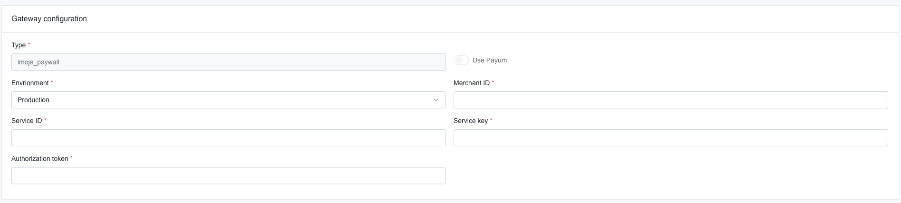

# ING Payments Plugin for Sylius
----

We want to impact many unique eCommerce projects and build our brand recognition worldwide, so we are heavily involved in creating open-source solutions, especially for Sylius. We have already created over **35 extensions, which have been downloaded almost 2 million times.**

You can find more information about our eCommerce services and technologies on our website: https://bitbag.io/. We have also created a unique service dedicated to creating plugins: https://bitbag.io/services/sylius-plugin-development. 

Do you like our work? Would you like to join us? Check out the **“Career” tab:** https://bitbag.io/pl/kariera. 

# About Us 
---

BitBag is a software house that implements tailor-made eCommerce platforms with the entire infrastructure—from creating eCommerce platforms to implementing PIM and CMS systems to developing custom eCommerce applications, specialist B2B solutions, and migrations from other platforms.

We actively participate in Sylius's development. We have already completed **over 150 projects**, cooperating with clients worldwide, including smaller enterprises and large international companies. We have completed projects for such important brands as **Mytheresa, Foodspring, Planeta Huerto (Carrefour Group), Albeco, Mollie, and ArtNight.**

We have a 70-person team of experts: business analysts and consultants, eCommerce developers, project managers, and QA testers.

**Our services:**
* B2B and B2C eCommerce platform implementations
* Multi-vendor marketplace platform implementations
* eCommerce migrations
* Sylius plugin development
* Sylius consulting
* Project maintenance and long-term support
* PIM and CMS implementations

**Some numbers from BitBag regarding Sylius:**
* 70 experts on board 
* +150 projects delivered on top of Sylius
* 30 countries of BitBag’s customers
* 7 years in the Sylius ecosystem
* +35 plugins created for Sylius

---
 

---

## Table of Content

***

* [Installation](#installation)
    * [Requirements](#requirements)
    * [Usage](#usage)
    * [Configuration](#configuration)
* [Functionalities](#functionalities)
* [Demo](#demo)
* [Additional Sylius resources for developers](#additional-resources-for-developers)
* [License](#license)
* [Contact and support](#contact-and-support)
* [Community](#community)

# Installation
----
The installation process for the Imoje Paywall Plugin can be found [here](doc/installation.md).

## Requirements
---
We work on stable, supported and up-to-date versions of packages. We recommend you to do the same.

| Package       | Version             |
|---------------|---------------------|
| PHP           | \>=8.1              |
| sylius/sylius | \>=1.12.13 - 1.13.x |
| MySQL         | \>= 5.7             |
| NodeJS        | \>= 14.x            |

## Usage

This plugin allows you to use the payment solution delivered by Imoje.

## Configuration

To create an ING-based payment method, go to Payment methods in the Sylius admin panel.
After that, you need to add an ING payment:

And now, you can configure your payment method in the admin panel:

To configure the imoje gateway, log in to ING the admin panel.

From "Settings" -> "Data for integration" you can acquire all the needed keys:

merchantId, serviceId, shopKey

Also, here in the integration data page you need to configure the path to your webhook, just type in your shop URL followed by /payment/imoje/notify

You also need an authorization token, so you need to go to: "Settings" -> "API Keys". And click on your "API key". This will be your authorization token.

# Functionalities

All main functionalities of the plugin are described **[here.](doc/functionalities.md)**

---

**If you need some help with Sylius development, don't be hesitated to contact us directly. You can fill the form on [this site](https://bitbag.io/contact-us/?utm_source=github&utm_medium=referral&utm_campaign=plugins_mollie) or send us an e-mail to hello@bitbag.io!**

---
# Demo 

---
We created a demo app with some useful use-cases of plugins! Visit http://demo.sylius.com/ to take a look at it.

**If you need an overview of Sylius' capabilities, schedule a consultation with our expert.**

# Additional resources for developers
---
To learn more about our contribution workflow and more, we encourage you to use the following resources:
* [Sylius Documentation](https://docs.sylius.com/en/latest/)
* [Sylius Contribution Guide](https://docs.sylius.com/en/latest/contributing/)
* [Sylius Online Course](https://sylius.com/online-course/)

# License
---

This plugin's source code is completely free and released under the terms of the MIT license.

[//]: # (These are reference links used in the body of this note and get stripped out when the markdown processor does its job. There is no need to format nicely because it shouldn't be seen.)

# Contact and support 
---
This open-source plugin was developed to help the Sylius community. If you have any additional questions, would like help with installing or configuring the plugin, or need any assistance with your Sylius project - let us know! **Contact us** or send us an **e-mail to hello@bitbag.io** with your question(s).

# Community
For online communication, we invite you to chat with us & other users on [Sylius Slack](https://sylius-devs.slack.com/).

