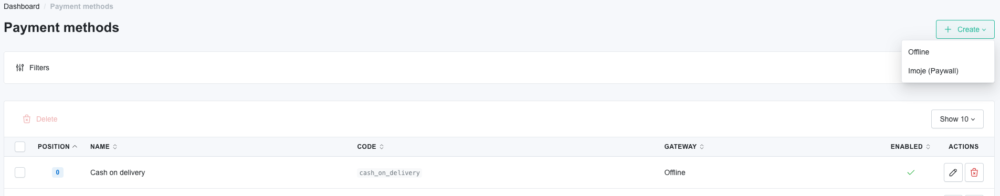
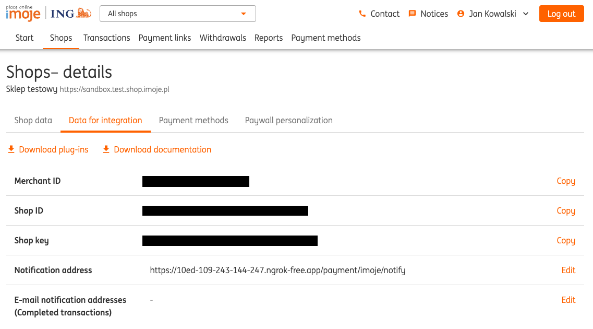
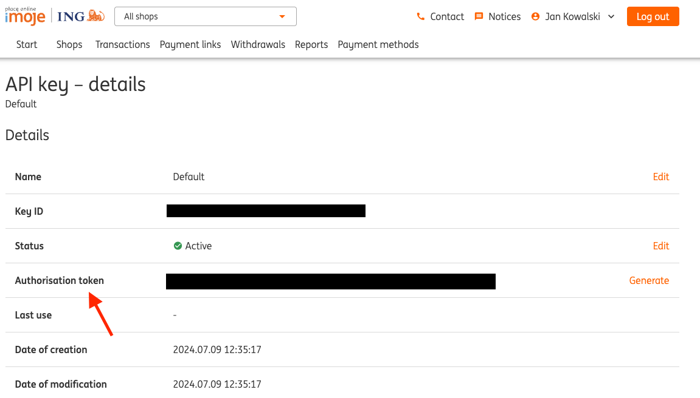

# Configuration

---

## Shop admin panel:
To create an ING-based payment method, go to Payment methods in the Sylius admin panel.
After that, you need to add an ING payment:

And now, you can configure your payment method in the admin panel:

## ING admin panel:
To configure the imoje gateway, log in to ING the admin panel.

- [Sandbox ING admin panel](https://sandbox.imoje.ing.pl)
- [Production ING admin panel](https://imoje.ing.pl)

From `Shops` -> `Your shop` -> `Details` -> `Integration data` you can acquire needed keys:

- Merchant ID,
- Service ID,
- Service key,

Also, here in the integration data page you need to configure the path to your webhook,
just type in your shop URL followed by: `/payment/imoje/notify`

In sandbox mode, you can use Ngrok or another tunneling program to expose your localhost.

The authorization token can be obtained from `Your profile` → `API keys` → `Details`

