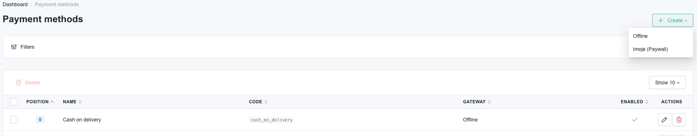
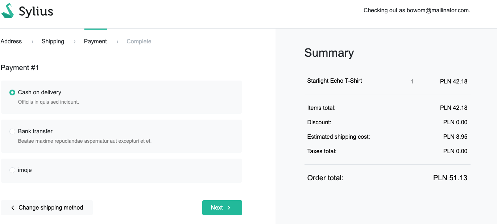

# Functionalities

---

The plugin integrates iMoje payments with Sylius based applications.

>iMoje is an online payment platform created by ING Bank Śląski, which enables online shops and service providers to accept payments from customers in Poland.
It is a comprehensive payment gateway service, offering various payment methods such as payment cards, fast online transfers (so-called pay-by-links), BLIK, mobile payments and deferred payments.

>In contrast to iMojePlugin, payment and selection of the payment type is carried out after redirection to a dedicated payment gateway.

- After an installation, user should be able to create new `Imoje gateway` payment method in the `Payment methods` section in the admin panel.

- And now, you can configure your payment method in the admin panel:

- After this, created payment method should be visible in the checkout.

